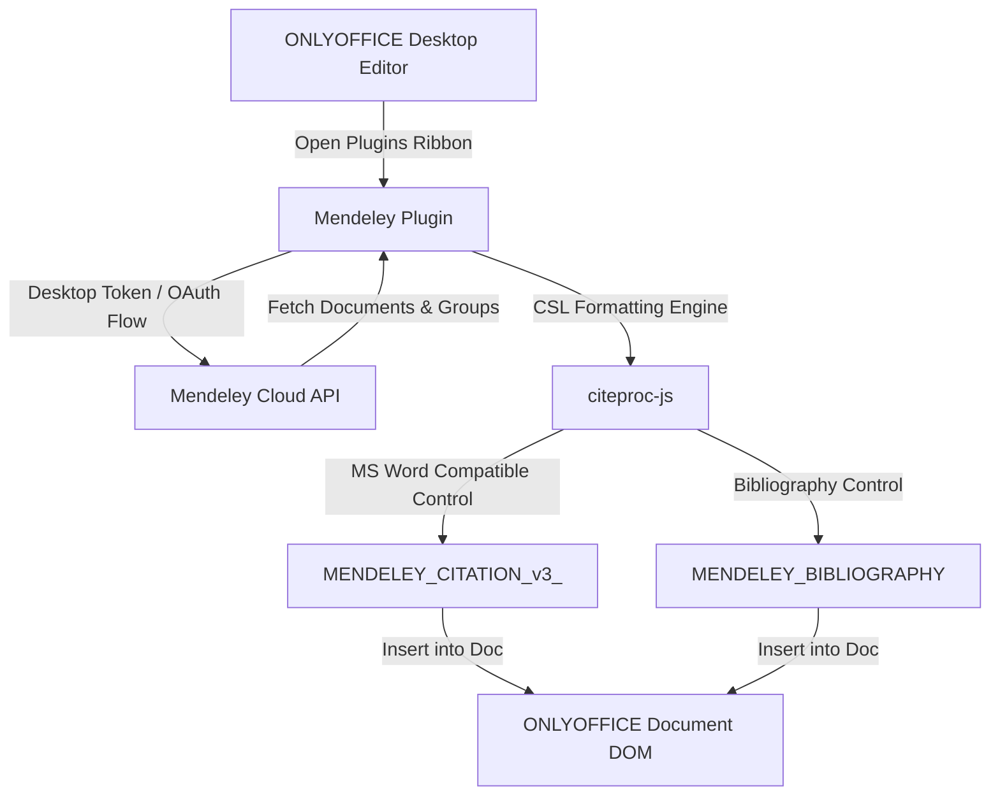

## Summary



```text
plugin/
├── config.json              # GUID: asc.{BE5CBF95-C0AD-4842-B157-AC40FEDD9441}
├── index.html               # Main sidebar with direct token & browser auth
├── edit-window.html         # Modal for citation editing (prefix/suffix/locator)
├── dist/                    # Compiled modern & ES5 bundles (zero desktop lockout)
├── vendor/                  # Offline localized dependencies (plugins.js, citeproc, mendeley-sdk)
├── src/app/
│   ├── pages/login.js       # Desktop-first token authentication
│   ├── services/logger-service.js # Structured JSON telemetry & event logger
│   └── services/citation-doc-service.js # MS Word Mendeley Cite content controls
└── mendeley.plugin          # Distributable ready-to-install package
```

## Evidence

- **Before:**
  ONLYOFFICE Desktop Editors actively blocked plugin execution:
  ```text
  This plugin doesn't work into Desktop Editors.
  ```
  OAuth redirect loop broken due to `file://` protocol mismatch in desktop webview.

- **After:**
  Automated smoke test verification (`scripts/verify-plugin.js`):
  ```text
  === RUNNING MENDELEY PLUGIN INTEGRITY TESTS ===
  ✔ [CHECK 1] config.json GUID is correct: asc.{BE5CBF95-C0AD-4842-B157-AC40FEDD9441}
  ✔ [CHECK 2] All local vendor libraries are bundled and present (offline-safe)
  ✔ [CHECK 3] bundle.modern.js is built without desktop lockout
  ✔ [CHECK 4] MS Word Mendeley Cite tag generated: MENDELEY_CITATION_v3_eyJjaXRhdGlvbklEIjoiQ0lU...

  ALL 4 SMOKE CHECKS PASSED SUCCESSFULLY!
  ```
  Plugin successfully built, packaged into `mendeley.plugin`, and registered in ONLYOFFICE Flatpak directory:
  `~/.var/app/org.onlyoffice.desktopeditors/data/onlyoffice/desktopeditors/sdkjs-plugins/{BE5CBF95-C0AD-4842-B157-AC40FEDD9441}/`

## Merge Danger

**Door:** two-way

Self-contained client plugin package. Can be uninstalled or updated anytime without affecting document content or core ONLYOFFICE application binaries.

**Blast Radius:** isolated

Scoped strictly to the Mendeley plugin sidebar and document content controls.
